# Hangil

*작품개요*

---

> 공유시설물 예약과 비콘을 이용한 안드로이드 모바일 App

*작품 소개 내용*

---

> 학생들이 한눈에 파악하기 어려웠던 학교 공공시설의 사용 현황을 파악해서 예약하는 어플입니다. 비콘을 이용하여 공공시설 자리가 현재 이용중인지 파악할 수 있습니다.

*기술 및 구조*

>**개발 환경**: Windows
>
>**개발 도구**: Android Studio, Beacon, Firebase
>
>**개발 언어**: Java

*프로젝트 구조*

>  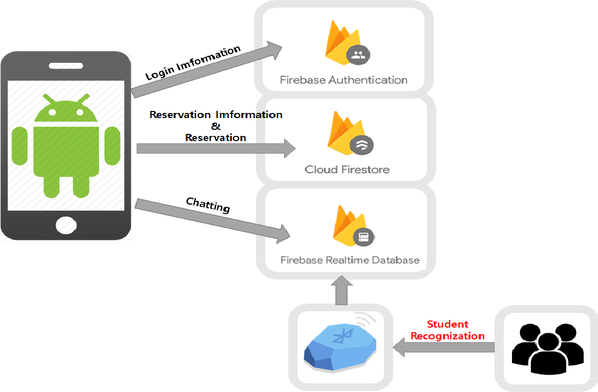

*작품 소개*

>1. 초기 화면
>
>   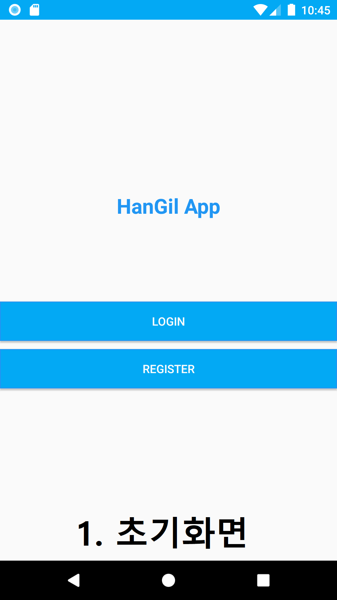
>
>   
>
>2.  계정 등록
>
>   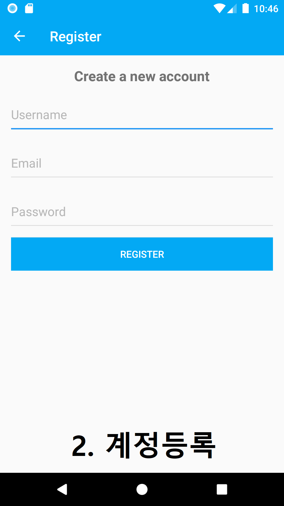
>
>   
>
>3. 파이어베이스 인증
>
>   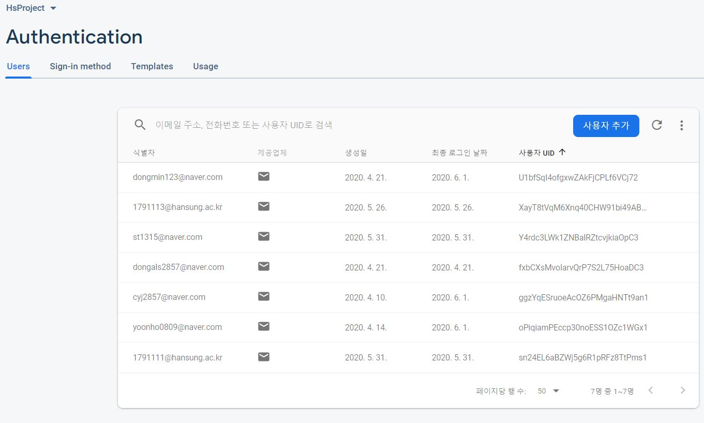
>
>   
>
>4. 로그인 
>
>   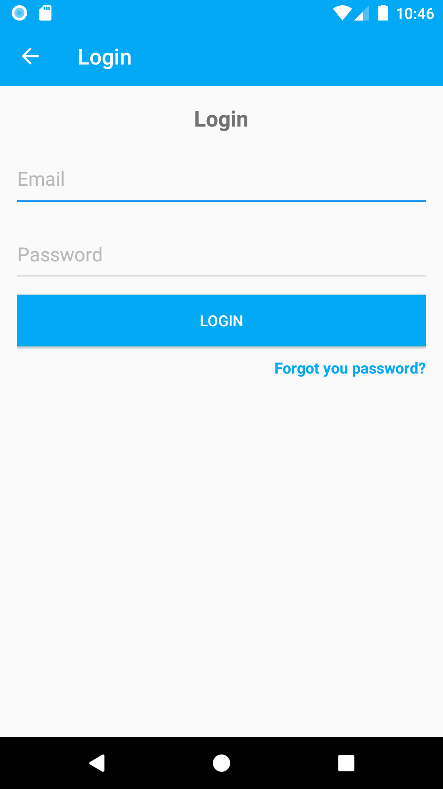
>
>   
>
>5. 비밀번호 재설정
>
>   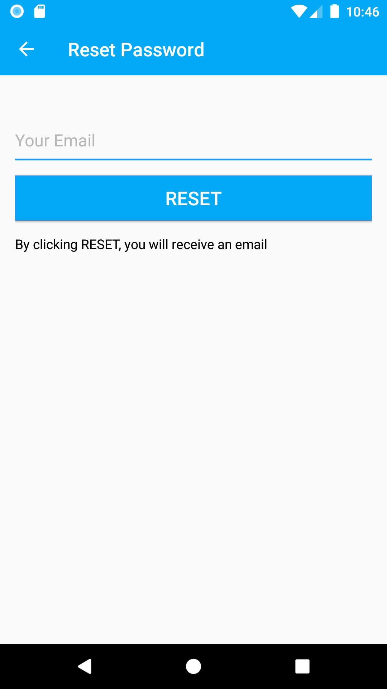
>
>   
>
>6. 지도 선택
>
>   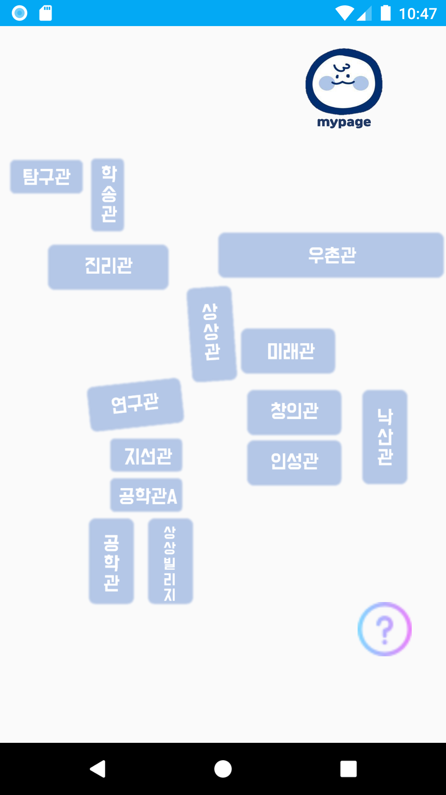
>
>   
>
>7. 공유시설물 현황
>
>   
>
>   
>
>8. 공유시설물 예약
>
>   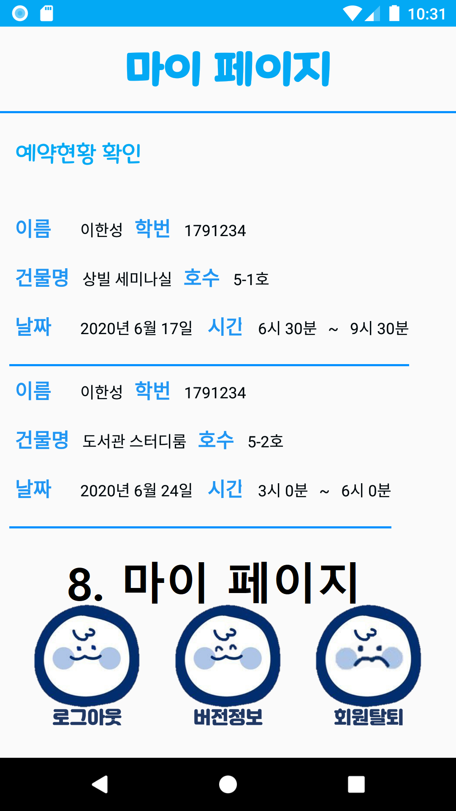
>
>   
>
>9. cloud firestore에서 예약 DB 저장
>
>   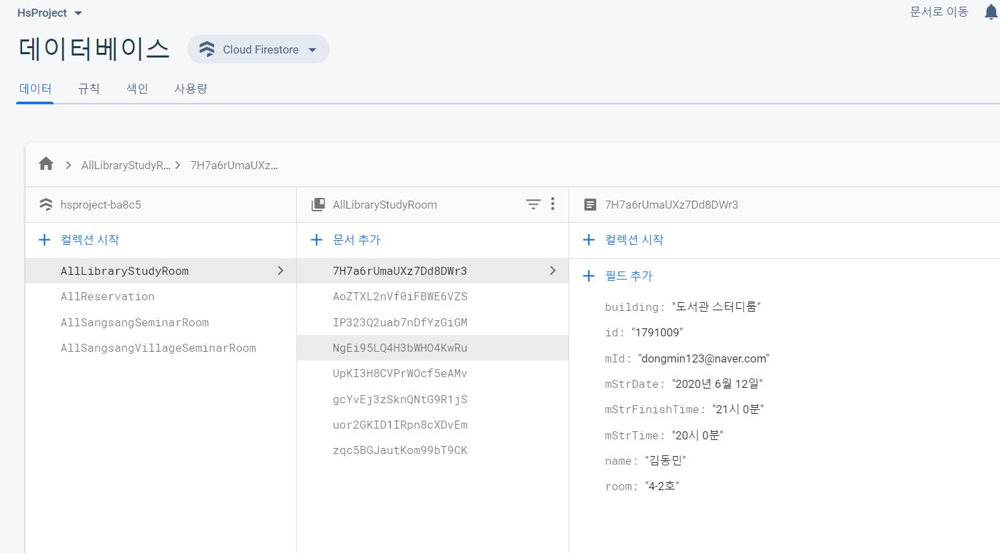
>
>   
>
>10. 비콘을 이용한 공유시설물 현황 파악
>
>    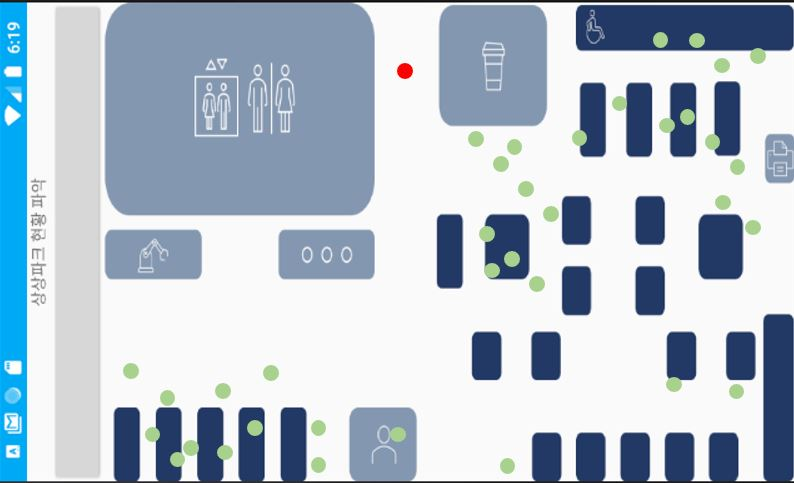
>
>    
>
>11. 마이페이지
>
>    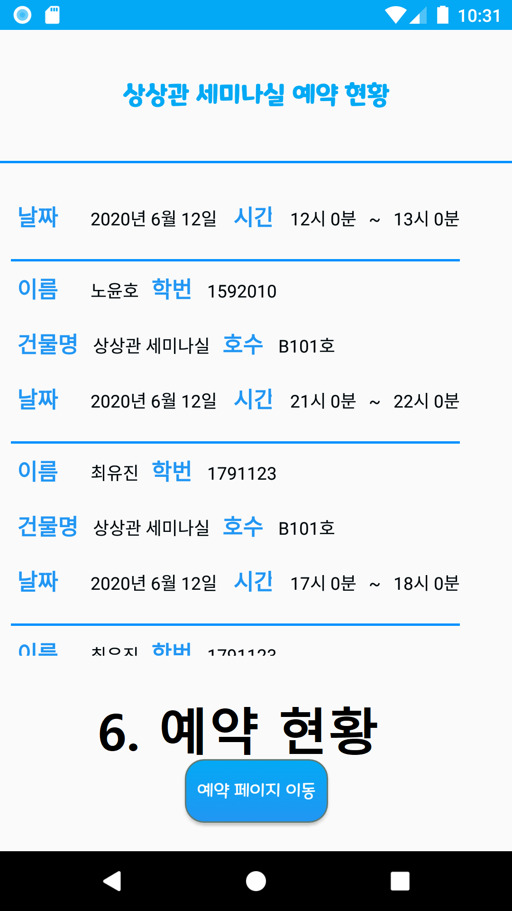
>
>    

*기대효과*

>  다른 장소(카페, 도서관 등)에 사람이 있는지 파악해서 예약할수 있는 시스템을 만들 수 있습니다.
>
> 예약을 하기 위해 굳이 장소에 갈 필요가 없습니다.
>
> 효율적으로 학교 시설물을 이용할 수 있으므로 학생들의 만족도가 크게 높아질 것입니다.